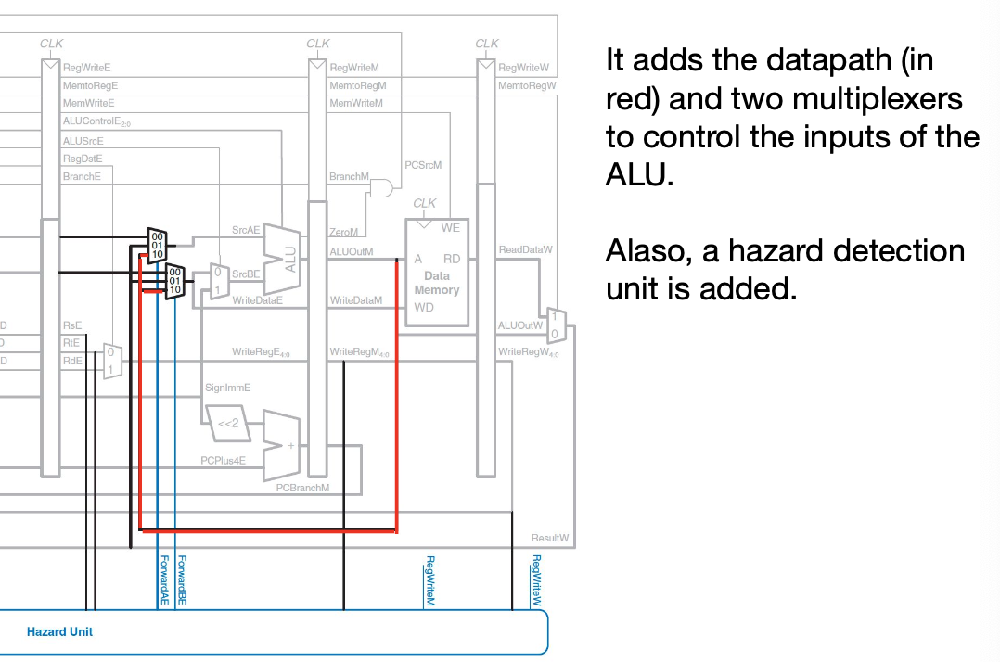
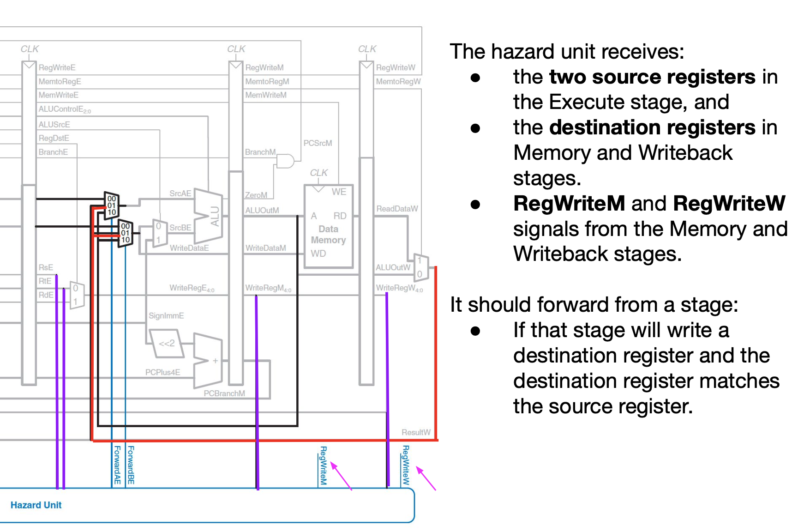

# Computer Architecture

## Preface

This is the Computer Architecture Learning Notes by Josiah Li. I took this course in FA24 and this course was taught by Xianbin Gu. Which was an unexpected changed after enrolling. I hope this learning notes can help whoever are reading. Wish you goodluck, and enjoy the fun of learning Computer Architecture!

This notes is made in a rush and there must be a lot of errors and typos, feel free to modify the file and please propose an issue in the repo, thats helps a lot!

This document is lastly modified December 21st, 2024.

## Starting Learning C 

#### Basic types

- types
- syntax

#### Control Structure

- loops
- conditionals

#### Basic components of the language

- variables: access to the memory
- operators
- conditionals 
- loops
- input/output
  - printf()
  - scanf()

#### Program Structure

- import files
- commentary (//)
- defines a function
- prints a chain of characters
- return value

#### Declearing variables, computing and printing

- When using a variable, define the variable before you use it in the form of:

  ```type variablename```

- Reason: help the compiler to use memory.

  - The atom of memory is a 'bit'
  - Usually the smallest unit of the memory is 8 bits, also called a 'byte'

- Variable memeory consumption:

  |  type  |      size (byte)      |
  | :----: | :-------------------: |
  |  char  |           1           |
  | short  |           2           |
  |  int   | 4 (-32,768 to 32,767) |
  |  long  |           8           |
  | float  |           4           |
  | double |           8           |

- printf format identifiers

  |            type             | identifier |
  | :-------------------------: | :--------: |
  |   Decimal signed integer    |   %d, %i   |
  |        Octal integer        |     %o     |
  |         Hex integer         |   %x %X    |
  |      Unsigned integer       |     %u     |
  | Long decimal signed integer |    %ld     |
  |    Long unsigned integer    |    %lu     |
  |          Character          |     %c     |
  |           String            |     %s     |
  |           Double            |     %f     |
  |           Pointer           |     %p     |
  |       Size of  a type       |    %zu     |

- Reading on the keyboard:

  - ` scanf("%c", &c) // in this case, &c is representing the memory address of variable c`

- The most usual types of C: double:

  - When assigning the value of a double to a integer, only the integer part will be kept. For example, if we use 3.14 and -3.14. 3.14 will be 3, and -3.14 will be -3.

- The most usual types of C: char

  - Some tips:
    - If we use %d to print a char, a integer will be printed, which is the ASCII code for the character.

#### Countrol structures

- **if-else**
- **for, while, do-while**
- **switch**
- **break** and **continue**

##### if-else:

- Some tips:

  - If an *else* is under a *if* without {}, then the *else* might be connected to the nearest if.

  - Moreover, it is notable that you can't use things like "and" in C like you do in python. You should use the following:

    | Operators | Representation |
    | --------- | -------------- |
    | &&        | and            |
    | \|\|      | or             |
    | !         | not            |

  - **Also, there is no boolean type in C, you shold use int 1 to represent True and int 0 to represent False.** (Actually, only 0 represent False)

- About the condition:

  - The expression like `x = 100` will return the value of x. In this case, 100. However, if you use something like below. Things will be a little bit interesting.

    ```c
    int a = 1;
    int b = 100;
    a = (b++);
    printf("%d, %d", a, b);
    ```

  - In this case, you will see the final value of a is 100, and for b is 101;

  - However, if you write the code in this form, it will be quite different:

    ```c
    int a = 1;
    int b = 100;
    a = (++b);
    printf("%d, %d", a, b);
    ```

  - In this case, a = b = 101

- Ternary operator. (三目运算符)

  - ` condition ? n : m` If the condition is true, return n, else m

##### for loop

` for (int i = 1; i <= 10; i += 1) { body of the loop }`

##### while loop

`while (boolen condition){body of the while}`

##### The do-while loop

```c
int n;

do {
	printf("Enter a positive number : ");
	scanf("%d", &n);
	if (n < 0) {
		printf("it should be positive");
	}
} while (n < 0)
```

##### The switch sturcture

Example:


```c
switch (expression) {
  case constant1 : sequence of instructions;
    break;
  case constant2 : sequence of instructions;
    break;
	...
  default : sequence of instructions by default;
    break;
}
```

#### Arrays and strings

##### Arrays

###### Initialization

- You can use things like ` int ary[4];` to initialize an array.

- You can use things like `int ary[4] = {0,1,2,3};` to assign values to ary.

- When the assigned values are not enough. The compiler will automatically assign q values to the first q cells in the array, the rest of the values will be assigned 0s.

  Example: If you use `int ary[4] = {0,1,2}`, the array will looks like [0, 1, 2, 0].

###### Storing

- The arrays are stored consequently in the memory.

##### Strings

###### Initialization

- In c, string is stored in a array-like method. (Especially, C will add a '\0' in the end of the array)

  Example: 

  ```c
  int main(){
  	char u[100];
    u[0] = 'H';
    u[1] = 'e';
    u[2] = 'l';
    u[3] = 'l';
    u[4] = 'o';
    u[5] = ' ';
    u[6] = 'W';
    u[7] = 'o';
    u[8] = 'r';
    u[9] = 'l';
    u[10] = 'd';
    u[11] = '!';
    u[12] = '\n';
    printf("%s\n", u);
  	return 0;
  }
  ```

  

### Pointer  *a variable pointing to memory address*

#### Basic grammar

```c
int myvar = 1;
int * ptr; // *ptr is a declaration, annotating that ptr is a pointer for int type
ptr = &myvar;
```

```c
bar = *myptr // this is getting the value of the address taht mypter is pointing at.
// For example, myvar += 1 can be written as:
*myptr = *myptr + 1;
```

**By using this, we can modify the value of the variables within the functions**

```c
// Example
vold increment(int* p){
  *p = *p + 1
}
```

**Moreover, pointer can point to a pointer** (I can tell it is getting chaotic)

```c
int main(){
  int i;
  int *p;
  int **q;
  int ***r;
  
  p = &i;
  q = &p;
  r = &q;
  ***r = 17;
  return 0;
}
```

#### Tips:

- **Warning**: When you are trying to compare two arraies by using '==', you are actually trying to compare two memory addresses, which is always false.
- **Also**, you cant assign a array to another by using 'a = b', But you can do this for structures
- **Moreover**, p = array and p=&(array[0]) can be treated equally.
- **Importantly**, a very important fact is that the sizeof array and sizeof p is different.
  - For example, if you have sizeof(an array) returns **The total amount of memory the whole array uses** and the sizeof the pointer is the size of that pointer

### Structure

#### Initialization

```c
struct coord{
  char name;
  int abs;
  int ord;
}; // This is the declaration of the structure.


struct coord a; // This is the declaration of the sturcture variable
```

`b = a // This will copy structure a to b`

#### Tips

- When using a structure as parameter for the function. In most cases. Using the address of the structure is more efficient than providing the whole structure.

- **A useful notation:** 

  ```c
  // The two things below are equal.
  (*ps).name
  ps -> name
  ```

  

### Unions *A data structure that can hole different data types*

**However**, all the values in a unions shares the same memory address (The length is detarmined by the longest memory allocation)

### OOP-like Programming in C

Practice, realizing a python-like list.

## MIPS - 一种指令集 (ISA)

### MIPS instruction set in assembly language.

#### Opcode and operand

The Design Principles of the MIPS architecture.

- **一致即简洁**

  - Every instruction of MIPS is of length 4 bytes= 32 bits.

- **微小即速度**

  - Only 32 registers in the MIPS architecture.

- **通况应更快**

  - MIPS provides immediate operands for small constants, which avoids

    load instructions

- **良好妥协产生良好设计**

  - The instructions are separated into three different formats: R, I, and J.

**Arithmetic Operations**

| Instruction   | Example           | Meaning         |
| ------------- | ----------------- | --------------- |
| add           | add $s1, $s2, $s3 | $s1 = $s2 + $s3 |
| subtract      | sub $s1, $s2, $s3 | $s1 = $s2 - $s3 |
| add immediate | addi $s1, $s2, 20 | $s1 = $s2 + 20  |


**Memory Operands**

每一个内存块中有一个8-bit byte （于此相对的，MIPS中一个寄存器有4倍内存块的空间）

操作：（注意 此时的word指的是MIPS架构一次处理的数据，被称为“字”）

| Instruction                         | Example         | Meaning                                                      |
| ----------------------------------- | --------------- | ------------------------------------------------------------ |
| Load memeory address into register. | lw $s1, 20($s2) | load a word (4 bytes) starting from the address ($s2 + 20), $s2 stores the base address, 20 is the offset (in bytes). |
| Write into memeory address          | sw $s1, 8($s2)  | load a word (4 bytes) starting from the address ($s2 + 8), $s2 stores the base address, 8 is the offset (in bytes). |

同时，因为字是4byte的，所以内存空间的索引偏移量必须为4的整数倍

**Big Endian vs. Little Endian**

MIPS是Big Endian的，which means MIPS的MSB（最重要字节，即代表数值最大，权重最高的字节）在最小的内存地址上。

### Representing data in binaries


对有符号整数，使用二进制补码表示法 (2's Complement)

MSB位为0，则非负，为1，则为负数

转换正负：


扩充长度：


### Representing MIPS instructions in binaries

**Use Binary to Represent Instructions**

​	Called Machine Code

**MIPS Instructions**

- Encoded as 32bit instruction words

#### Instruction Format: The layout of the instruction.

- R-format (for register)
- I-format (for immediate)
- J-format (for unconditional jump)

#### MIPS R-Format Instructions

### 

#### MIPS I-format Instructions


#### MIPS J-format Instruction


### Logical operations and shift operations


### Conditional operation and loop statements


**样例：**

#### Basic Blocks 基本块

**特点：**

- 单一入口
- 单一出口
- 内部无跳转指令

**slt, slti 命令：判断大小**


*sltu, tui命令* 判断无符号数的大小

**Pseudoinstructions: 伪指令**

一般来说一个指令只对应MIPS中的一个命令，但是有一些编译器或汇编器提供一种特殊指令（被称作伪指令，会被编译器转译之后执行）

example:


**jal和jr assembly的函数调用**

**jal的作用 （jump and link）**

 跳转到 ProcedureLabel 位置，同时将当前位置的引用记录到$ra位置

**jr的作用** **（jump return）**

返回到调用函数的位置

```assembly
main1:
    jal function      # 调用函数，返回后继续执行 main1

main2:
    jal function      # 在不同地方再次调用相同的函数

function:
    # 函数体代码
    jr $ra            # 返回调用函数的地方
```

**Leaf Procedure**

类似于basic block，指的是不调用其他函数的过程。

**Additional Arguments**

在函数传递参数的过程中，MIPS预留了a0-a3寄存器，若参数量大于4，则需要使用内存中的栈传递。

## Digital Logic

### Circuit: A black box

Circuits take one or more inputs, have one or more outputs.

Inside the black box. There are

- nodes
- elements


### Boolean algebra & Logic gates

 

Boolean laws:


**De morganatic duality**
$$
\lnot p\times \lnot q = \lnot (p+q)\\
\lnot p + \lnot q = \lnot (p\times q)
$$
**Sum-of -products form(SOP)**

SOP is a kind of method, using the form of boolean algebra to express the logic circuits.

e.g., 
$$
F(A,B,C)=\bar ABC + A\bar B\bar C+ ABC
$$
**Converting a truth table to the SOP form**

 


**Product-of-sums form**

Another way to express the Boolean functins in Boolean algebra.

e.g.,
$$
F(A,B,C) = (A+B+\bar C)\cdot(A+B+C)
$$


**IMPORTANT!!!** In this place, the picture is not correct! The formula should be Row 1: $$(A + B + C)$$ but not $$(\bar A + \bar B +\bar C)$$!!!

### Logic gates


**Bubble Pushing**

Reason: NOR and NAND gates are easier to build.


Core: De Morgan's Law
$$
A \and B=\lnot(\lnot A+\lnot B)\\\lnot \lnot A=A
$$
**Karnaugh Maps**

合并相邻的一

关于卡诺图化简，有一个写的很好的博客：https://blog.csdn.net/hahasusu/article/details/88244155

### Two types of logic

- Combinational Logic

  - Output depends solely on the current inputs, without any memory of past states. It’s used for operations that need immediate calculation, like arithmetic and data selection.

- Sequential Logic

  - Output depends on both current inputs and

    past states, providing memory through components like flip-flops

    and registers. Sequential logic enables systems to remember

    information and operate in stages, crucial for tasks that need

    state retention and timing control.

differences:


### Combinational Logic

#### Decoder 

用于把输入输出对应，根据输入来确定具体哪一条输出


#### Multiplexer

用于从输入中选择一条线路输出


Which means,
$$
Y = D_S
$$

#### 4:1 multiplexers

Have 4 inputs and two selection inputs. Allows the multiplexers to select one output from 4 inputs.


Often used while implementing the Sum-of-products method.

**PLA:** Programmable logic array

A PLA has a set of inputs and corresponding input complements (which can be implemented with a set of inverters), and two stages of logic.


### Timing

When a input changes, it might take some time for the circuit to make response. 

**Rising edge and Falling edge:** 分别表示信号由0变为1和由1变为0的过程

**Delays:**

- Propagation Delay: $$t_{pd}$$  the maximum time from when an input changes until the output or outputs reach their final value.
- Contamination Delay: $$t_{cd}$$ the minimum time from when an input changes until any outputs starts to change its value.

**Paths:** 

- Critical Path: The longest path that signals must traverse in a digital circuit.
- Short Path: The shortest path throught the circuit.

**Worst-case value:**

将所有propagation delay相加


**Glitch:** 当某些输入变化的时候，输出无法及时的作出对应的改变。

解决方法：在对应的状态下添加冗余量


### **Sequential Logic:** 

Output depends on both current inputs andpast states, providing memory through components like flip-flops and registers. Sequential logic enables systems to remember information and operate in stages, crucial for tasks that need state retention and timing control.

**Clock Signals:** (defining the system time)

**edge-triggered clocking:** all state changes occur on a clock edge (rising edge or falling edge).


**Memory elements:** 

- Latch: a fundamental building block in digital circuits used to store a bit of data.
  - Two types: SR latch and D latch
  - Store one bit of data
- Flip-flop: Basic building blocks that store a single bit of data and change state based on the clock signal.

**SR latches:** 


初始状态不确定

当reset为1时，系统重置为Q=0

若S=1 则Q=1

**D latches**


D锁存器：

​	当CLK是0的时候，D锁存器处于锁定状态，始终只保持之前的状态

​	当CLK是1的时候，D锁存器进入透明状态，输出Q跟随输入D，$$\bar Q=\bar D$$

**D Flip-Flop**

由两个D latches组成，实现的效果是只在时钟边缘时更新Q的值


**Registers 寄存器**


所以其实，register可以理解为数个flipflop的集合体

**Enable flip-flop**

相当于有一个开关的flipflop，当EN为1时，为一般flipflop用法，当是0时，停止更新值，而是保留原状态不变。


错误产生的原因: cyclic paths, 即输出被直接回传给了输入

解决方法：引入寄存器，使其成为sequential synchronous电路

值得注意的是，如果存在cyclic path但是无寄存器，会被归类为既不是CL也不是SL

### Finite State Machine 有限状态机

**Definition:** it is a mathematical model used to describe a system that transitions between different states based on inputs.

**Components:** 

- States

- Transitions: rules or conditions that determine how the system moves from

  one state to another

- Input

- Output

- Initial State

**Example:** 

**Two Types FSMs**

- Moore Machine
  - outputs depend solely on the current state, regardless of the input（只由当前状态决定）
- Mealy Machine
  - outputs depend on both the current state and the input.（由当前状态和输入决定）

**状态转换表**


描述了在不同状态下对于不同输入的转换方式


State Register: Register to store the current status.


### Digital Building Blocks 

#### Carry Propagate Adder


对于CLA(Carry Lookahead Adder) 我个人的理解是，通过把结果不同位数表达为输入A和B对应位数的布尔运算，从而同时对多位进行运算

#### **Subtraction**

$$Y=A-B \implies Y=A+\bar B + 1$$


#### Equality comparator

检查每一位，利用$$A \oplus B = 0 \iff A = B$$, 使用NOT XOR门处理


#### Magnitude Comparator

Utilizing the property that $$A < B \iff A - B<0$$. Checking the result by looking at its sign bit.

$$[N-1]$$ represents the most significant bit.


#### ALU: Arithmetic Logic Unit

Very powerful! Intergrate all the basic logic functions.


**Implementation**


#### Shifters

有几种shifters


总结起来就是，Logical Shifter会把空出来的位设为0，而Arithmetic Shifter在进行右移时会保留最高位的同时进行位移。

Multiplication 和 Division 有点复杂现在看不懂周末回来看

#### Sequential Building Blocks

##### Counters


##### Shift registers

通过多个cascaded flip flops, 实现一位位输入，一位位输出的效果，寄存器需要N个时钟周期的时间进行加载


#### Memory Arrays


有$2^N$个wordline, 每一个内存地址对应一个wordline, 在访问一个内存地址时，会通过bitline输出这条word上所有的bit

**Memory ports** 感觉没有太多很重要的内容


Memory 分为Static Random Memory (SRAM) 和Dynamic Random Access Memory (DRAM)

DRAM的实现方式为capacitor而SRAM实现形式为触发器。优点在于DRAM由于实现原理为电容，存在电荷流失问题，需要定时刷新。相比之下SRAM的存储原理决定其稳定不需要供电，但是两者都需要持续供电。


Register files 寄存器文件，常被用作处理器的关键存储单元，用于快速访问操作数


不同于前面的RAM，**ROM** is non-volatile memory. 实现方式为在一部分bits的地方空置电路


上图是一种实现方式，通过低熔断保险丝（fuse）实现可编程ROM This is called One-Time Programmable ROM. As the fuse can't be recovered after programming.

#### Logic Arrays

There are two types of logic arrays

- PLAs: programmable logic arrays
- FPGAs: field programmable gate arrays

区别是PLA结构较为简单，一般是由逻辑门的组合实现，而FPGA的实现方式较为复杂，且可多次编程，逻辑配置可更新。实现方式为内部大量可编程逻辑单元（logic elements, LE）可编程互联（interconnects）和I/O块（Input/Output Elements, IOE）组成

## Processor

**Single-cycle microarchitectures** 连接Digital Circuits和MIPS的桥梁

Computer Architechture = Instruction Set + Architectural State

这里主要以MIPS为研究对象

MIPS的架构状态(Architectural State)主要包括：

- Program Counter(PC) 的值
- 32个寄存器的值

基于当前的架构状态，处理器执行特定的指令和特定数据集来生成新的架构状态

在这里我们只考虑MIPS指令集中的一部分指令来简化学习过程


Microarchitecture通常被分为两个相互作用的部分：

- **Datapath:** a collection of functional units and connections whitin a processor that carry out data processing operations specified by the onstruction set. datapath运行的标准是一个word的data
  - 包含结构如 **Memories, registers, ALU and multiplexers**
  - 在MIPS中，datapath长度为32位，因为MIPS架构为32位架构

- **Control:** receives the cureent instruction from the datapath and tells the datapath how to execute an instruction.
  - It produces signals like the multiplexer select, register enable, and memory write to control the operation of the datapath.

数据通路是执行数据操作的“行动者”，控制单元是管理和指导的“指挥者。

我们在设计复杂系统时，常常从state elements入手


### Basic Blocks

#### Program Counter

PC的输出是当前指令的内存地址，输入(PC')是下一条指令的内存地址


#### The instruction memory


指令存储器是处理器中专门用于存储和提供指令的模块

输入一个指令地址（由PC提供），输出对应地址的指令

#### The register file

一个组件，允许并行的读取两个地址的数据以及写入一个地址的数据，所有的操作都可并行进行

值得注意的是，the register file存取的为寄存器中的数据，而不是内存中的数据

其中A端口为操作的address，WD3为希望写入的数据，WE3为write enable input, 当WE3为高电平时，将WD3写入对应的地址，反之则在RD1和RD2输出对应地址的数据


#### Data Memory

用于存取内存数据的结构，WE为同样的write enable数据，WD为写入数据（write data），A为写入地址，RD为输出内容（Read Data）


### MIPS microarchitectures

MIPS microarchitectures包含下面的几种：

-  Single-cycle microarchitecture
- Multiple-cycle microarchitecture
- Pipelined microarchitecture

### Single-cycle microarchitecture

一般的，对于一个指令，遵循下面的顺序执行：

1. Fetch (取指令)
2. Decode (指令译码)
3. Execute (执行)
4. Memory Access (访存)
5. Write Back (写回) 

这里以lw(load word)指令为例子


通过Instruction memory取指令，将指令分块后利用regfile获得寄存器数据，使用ALU进行运算得到最终需求地址，使用Data Memory访问内存得到最终结果，最后写回。

如果仔细观察会发现lw和sw其实实现方式非常接近，故可以通过同一个电路，根据输入控制信号不同来控制逻辑，结合两种电路，我们得到下面的内容。


对于其他的设计，也是类似的，不同指令的区别就在于通过改编控制信号和multiplexer来选定信号通路

下面是MIPS processor的single-cycle实现


核心分析：Main Decoder. 用于根据Opcode类型输出指令信号


下面是Main Decoder输出控制信号的对应关系：

- MemtoReg
  - 控制Data Memory后的选择器，当MemtoReg为1时表示指令需要将Data Memory读取的内容保存到寄存器
- MemWrite
  - 控制Data Memory，连接Data Memory的Write Enable端口，当MemWrite为1时表示指令需要写入内存数据
- Branch
  - 指示指令是否有可能需要改变下一条指令位置，这里需要与ALU的zero端口取与运算
  - P.S. ALU Zero port indicate that whether the calculation result of ALU is zero. 在这里，因为ALU使用相减的操作来判断是否相等，所以只有在Zero等于0的时候在说明两数相等


- ALUSrc
  - 用于决定第二个ALU输入的来源，当为低电平时，multiplexer将选择第二个寄存器输出作为ALU输入
- RegDst
  - 用于决定指令中意图写入之寄存器的地址
- RegWrite
  - 与Register File中的Enable端口连接
- ALUOp
  - 传输给ALU Decoder进行ALU专门的操作

**ALU Decoder**的真值表：


**Main Decoder**的真值表： $\star$


### **Multicycle microarchitectures**

single-cycle processor的缺点

- 所有的命令都在同一时钟周期下运行，这意味着时钟周期设计将以耗时最长的命令为妥协。（比如lw命令）

- 需求更多的高速加法器
- 将数据内存和指令内存分离，which might be not realistic

故引入Multicycle processor

对于multicycle processor，在每一步，处理器只能在下列两个操作中选择一个

- 读写内存或寄存器
- 使用ALU

一个命令被执行的过程也将分为下面这几个步骤

1. Fetch
2. Read Base Address & Extend the Immediate
3. Add Base Address to Offset
4. Load Data from Memory
5. Write Data back

然后，在每一个步骤执行后存入每一个线路块间的寄存器。

### MIPS processor, multiple-cycle implementation.


下面是控制单元的结构：


从图中我们可以看出，所有的输出信号被分为两类：

- Multiplexer Selects 用于进行multiplexer的输出选择
- Register Enables 用于进行寄存器的使能控制

下面是Decoder输出控制信号的对应关系：

- MemtoReg

  - 控制Data Memory后的选择器，当MemtoReg为1时表示指令需要将Data Memory读取的内容保存到寄存器

- RegDst

  - 用于决定指令中意图写入之寄存器的地址（需要它的原因是在某些不同的命令中目标寄存器的地址存在于指令的不同位置）

- IorD

  - 用于决定需要读取的地址来源是I (Instruction) or D (Data Access). 这里的作用就是控制存储器地址的来源，用于在取指令和数据访问两种操作之间切换，这里IorD存在的原因是将instruction和data放在了同一个内存中。

- PCSrc

  - 连接到图中蓝线所连接的multiplexer，用于决定是否**延迟一个时钟时间输出ALU结果**

  

  - 即
    - 顺序执行时， PCSrc=0: multiplexer使用PC+4，无需延迟，PC直接更新为下一条顺序指令的地址
    - 分支跳转时，PCSrc=1: multiplexer使用存储的跳转地址，此时需要存储的跳转地址（延迟了一个周期的ALU结果来更新PC）

- $$ALUSrcB_{1:0}$$ 

  - 用于控制ALU的B端口输入

- $$ALUSrcA$$

  - 用于控制ALU的A端口输入

- IRWrite

  - ·IRWrite用于控制PC'是否更新，此处的IRWrite需要和其他信号结合形成PCEn信号

  

  

- MemWrite

  - 控制Data Memory，连接Data Memory的Write Enable端口，当MemWrite为1时表示指令需要写入内存数据

- PCWrite

  - 指示当前阶段是否允许写入PC
    - 在大多数情况下，PC将按顺序更新为PC+4，此时PCWrite=1，允许写入PC+4的值进入PC
    - 分支指令（如beq），此时PC应更新为分支目标地址，此时PCWrite=1，允许写入PC
    - 跳转指令（如j和jal），此时PC直接更新为跳转地址，此时PCWrite=1，允许写入PC
    - 保持当前PC，在指令其他阶段（如编码，执行阶段），不需要更新PC，此时PCWrite=0，PC保持不变

- Branch

  - 指示指令是否有可能需要改变下一条指令位置，这里需要与ALU的zero端口取与运算
  - P.S. ALU Zero port indicate that whether the calculation result of ALU is zero. 在这里，因为ALU使用相减的操作来判断是否相等，所以只有在Zero等于0的时候在说明两数相等


- RegWrite
  - 与Register File中的WriteEN端口连接，控制是否写入register
- ALUOp
  - 传输给ALU Decoder进行ALU专门的操作

从FSM的角度来看lw和sw命令，不同的states将在时钟上升沿切换


下面是完整的state machine设计


### Performance analysis


计算multicycle processor的CPI


总结就是$T_{c}=t_{pcq}+t_{mux}+\max(t_{ALU}+t_{mux},t_{mem})+t_{setup}$

### **Pipelined microarchitecture**

一些用于描述系统速度的词汇

- **Token**: a group of inputs that are processed to produce a group of outputs. (i.e., a task)
- **Latency** 延迟: the time required for one token to pass through the system from the start to end.
- **Throughput** 吞吐量: the number of tokens that can be produced per unit time.

对于提高throughput，我们有这样两种方法

- Spatial Parallelism
- Temporal Parallelism

pipelined，通过添加寄存器来实现这样一个目标：将每个指令划分为不同的阶段，从而达到在同一时间可以同时运行几个指令的不同阶段的目的


| 特性                   | Multicycle                       | Pipelined                          |
| ---------------------- | -------------------------------- | ---------------------------------- |
| **每周期的工作内容**   | 一条指令的一个阶段               | 多条指令的多个阶段同时进行         |
| **寄存器的作用**       | 存储当前指令在各个阶段的状态     | 隔离各阶段，保证流水线运行稳定     |
| **硬件资源复用**       | 是，多个周期内复用硬件资源       | 否，所有硬件资源同时运行           |
| **指令的执行过程**     | 串行处理一条指令                 | 并行处理多条指令                   |
| **性能表现（吞吐量）** | 较低（每个周期只完成一部分指令） | 较高（每周期完成多条指令的一部分） |
| **延迟（Latency）**    | 每条指令需要多个周期完成         | 单条指令延迟等于流水线深度         |

**The bane of Parallelism**

parallelism引起的问题：如果task B依赖于task A的运行结果，那么task B在task A完成之前就不能开始运行

为了设计Pipelined结构的MIPS processor，我们将single- cycle MIPS processor分为下面五个阶段：

1. Fetch (IF, Instruction Fetch)
2. Decode (ID, Instruction Decode)
3. Execute (EX, Execute)
4. Memory (MEM, Memory)
5. Writeback (WB, Writeback)


throughput的计算，在singlecycle processor中，因为每个cycle只执行一个命令，所以$throughput= \frac{1}{t_{cycle}}$，同样的，在pipelined processor中，因为在每个cycle都可以有命令开始与结束，那么$throughput= \frac{1}{t_{cycle}}$同样成立


### Pipelined datapath

Pipelined datapath由single-cycle datapath用四个registers分割为五个阶段实现，具体的实现线路如下图


### Hazard

**A hazard in a pipelined system refers to a situation that causes incorrect behavior or delays in instruction execution within a pipeline.**

在计算机体系结构中，**hazard（冒险）** 是指由于指令并行执行（例如在流水线中），导致指令之间发生资源争用、数据依赖或控制冲突的问题。这些问题会影响指令的正确执行和流水线的效率。

Hazard被分为下面的几种类型

- data hazard
- control hazard
- structural hazard

#### Data Hazard

**数据冒险**

当一条指令需要使用前一条指令的计算结果，但结果尚未准备好时，就会发生数据冒险，数据冒险的主要原因是流水线中的数据依赖。

常见类型

- Read After Write (RAW)
- Write After Write (WAW)
- Write After Read (WAR)

在MIPS中，WAW和WAR问题并不会出现，因为一些神奇的原因

fromGPT

所以我们着重分析RAW Hazard的解决方法

我们一般用下面两种方法解决这个问题

- Using forwarding (also called bypassing) 将依赖数据转发给所需的指令
- Using stall 暂停下一步指令执行过程，等待上一步结束

##### Using Forward

我们需要做的事将依赖的数据转发到需要的步骤，实现方法为在ALU source处添加multiplexer，用于接受来自下一个阶段的数据

这时我们就需要添加一个hazard detection unit用于控制是否引入下一个阶段的数据

**下图实现的是$Memory\implies Execute$的转**发



- 实现
  - 路径：从MEM的流水线寄存器中读取ALU的结果，直接通过数据转发路径（红色）传递到EX阶段的ALU输入
  - 控制：
    - Hazard Unit检测到EX阶段当前指令的源寄存器和MEM阶段指令的目标寄存器相同（存在数据依赖）
    - Hazard Unit生成控制信号，激活Multiplexer，选择从MEM阶段转发的数据作为ALU的输入

**下图实现的是$Writeback \implies Execute$的转发**



- 实现
  - 路径：从WB阶段的流水线寄存器中读取ALU或数据存储器的结果，通过数据转发路径（红色）传递到EX阶段的ALU输入
  - 控制：
    - Hazard Unit检测到EX阶段当前指令的源寄存器和WB阶段指令的目标寄存器相同（存在数据依赖）
    - Hazard Unit 生成控制信号，激活 Multiplexer，选择从 WB 阶段转发的数据作为 ALU 的输入

**Load-Use data hazards** 这是一种无法依赖Forwarding解决的冲突，根本原因在于，此处第二条指令所需要的数据在上一条指令也未取得，所以需要引入其他的处理方法。


这里我们尝试通过引入**stalls**来解决这里的数据冲突。


- 实现
  - 控制：
    - Hazard Unit生成控制信号StallF和StallD，用于阻碍取指和解码阶段的更新，从而暂停流水线的更新。
    - Hazard Unit生成控制信号FlushE，用于清空Decode $\to$ Execute 阶段的pipeline register，从而达到暂停后续运行的作用

#### Control Hazard

**控制冒险**

产生原因：流水线在分支决策尚未完成时，就已经按原有顺序加载了下一条指令。

解决方案：

- Stall untill the decision is made.
  - The decision is made in the Memory stage, the pipeline would have to be stalled for three cycles at every branch.
  - 严重影响性能
- Predict whether the branch will be taken and begin executing instructions based on the prediction.
  - 分支预测后，处理器会基于预测结果预先加载并执行指令。
  - 若预测错误，则需要丢弃指令并重新加载指令流

清除指令流


在这里，为了降低惩罚，我们尝试提前预测branch decision，这需要我们引入一个新的硬件块，用于特别预测分支方向。


然而，此处的Early Branch Decision会引入新的Data RAW hazard，鉴于我们在此前并没有引入这一条冲突处理路径，我们额外设计一条路径进行冲突处理。

> 这里的 RAW 冒险确实需要不同于传统的 MEM to EX 和 WB to EX 的转发路径，因为分支指令的条件判断发生在解码阶段（Decode Stage），而不是执行阶段（EX）。通过这种特殊的转发机制，能够加速分支决策，减少控制冒险的影响。
>
> --- ChatGPT

完全体的Pipelined Processor with Hazard Handling


#### Structural hazard

**结构冲突**


原因为在不同的阶段尝试使用同一个组件。解决方法也很简单粗暴，引入新的组件。

### Others


性能分析


## Acknowledgements

Many thanks to Z-lib. If you never heard of it, I highly recommend you to download the textbooks form it. In  contrast to this document and the lecture slides, the course textbooks can provide a more detailed knowledge structure. 

## References

1. Xianbin Gu, Computer Architecture, FA24_CENG_SHU_202_SH
2. Digital Design and Computer Architecture, by David Money Harris & Sarah L. Harris, 2nd edition.
3. Computer Organization and Design: The Hardware/Software Interface, by David A. Patterson & John L. Hennessy, MIPS edition.
4. The C programming language, by Brian W. Kernighan and Dennis M. Ritchie, 2nd edition.
5. OpenAI, ChatGPT
6. https://foxsen.github.io/archbase/index.html

